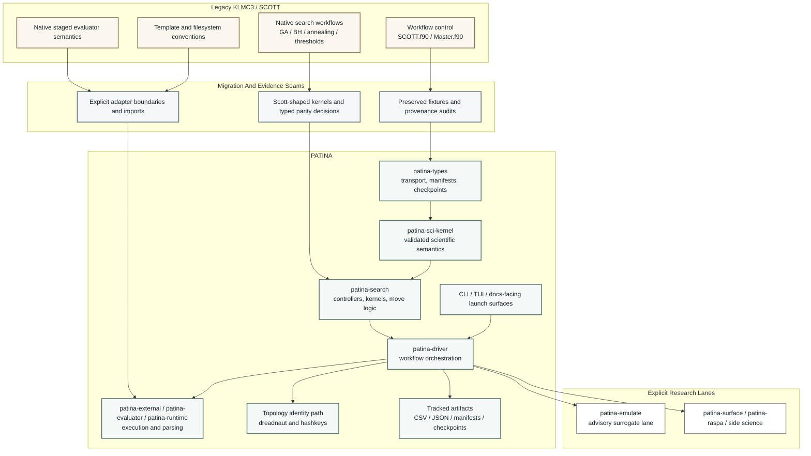

# 6.2 Architecture

The working architectural picture is:

The practical boundary rules are:

- `patina-types` carries transport and checkpoint data
- `patina-sci-kernel` owns validated scientific structure semantics
- adapter crates own external-program specifics and subprocess behavior
- application crates own orchestration
- research lanes such as `patina-emulate` stay explicit instead of being hidden inside parity-core services

> [!NOTE]
> Readers approaching from the scientific side should read this page together with
> [6.1 Hexagonal Ports And Adapters](../software-architecture/hexagonal-architecture.md).
> The same boundary that protects software maintainability also protects scientific semantics from
> being mixed with file-format and subprocess details.

## Why This Diagram Is Larger Than Before

The architecture is not only a clean-room Rust design. It is a migration from a historically rich
Fortran workflow stack into a more explicit system of kernels, services, and adapters. The diagram
therefore needs to show four things at once:

- where KLMC3 meaning came from
- which seams preserve or audit that meaning
- how PATINA separates core semantics from orchestration and adapters
- where research lanes such as emulation sit without contaminating parity-core behavior

The public book should still explain these boundaries with small, testable examples rather than
giant code dumps, but the map itself has to admit the real migration complexity.
