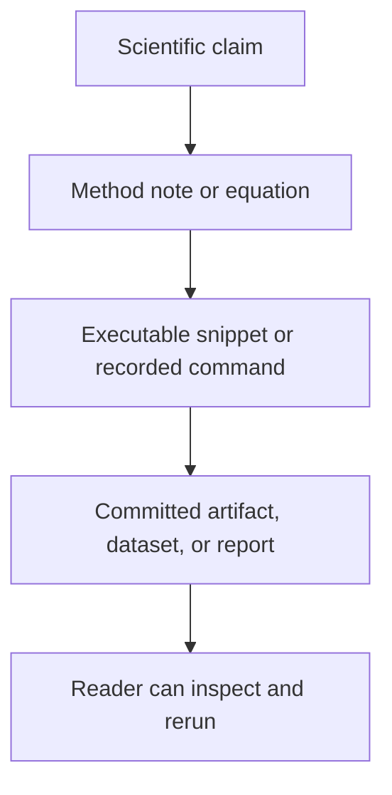
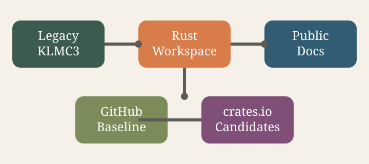

# 4. Scientific Foundations

  The scientific foundation of <code>patina</code> has to work for two readers at once: the
  computational-chemistry reader who wants the optimisation story and the software reader who wants
  the reporting contract that makes that story trustworthy.

## What This Section Does

- Methods:
  Global-optimisation algorithms are explained as durable scientific ideas, not unstable code
  snapshots.
- Reporting surface:
  Equations, executable Rust, build-time command output, interactive plots, and structure viewers
  can live together without turning the Markdown into a layout exercise.
- Boundaries:
  The scientific explanation is separated from transient crate layout, but still linked to real
  workflow surfaces where the current Rust workspace already owns them.

## What Belongs Here

The scientific-foundations lane should explain:

- what is being optimised and why the landscape is difficult
- how genetic algorithms, basin hopping, and Monte Carlo style search differ
- how active-learning and emulator ideas relate to exact evaluation
- how AutoEmulate-backed property guidance should be presented without erasing exact provenance
- which equations matter to interpretation, acceptance, or reporting
- which papers anchor each method claim
- what artifacts make a run auditable in `patina`

It should avoid pretending the present internal crate split is the final public ontology.

## Book Instrumentation

This book already supports the scientific reporting stack we want for public-facing `patina` docs:

- MathJax for equations
- Mermaid for process and architecture diagrams
- editable Rust snippets for small executable ideas
- `mdbook-cmdrun` for build-time command output
- Plotly.js for interactive data views
- 3Dmol.js for browser-based `.xyz` and `.cif` inspection

That combination is the current balance point: rich enough for serious explanation, but still
simple enough to keep the book reproducible.

## Stable Reporting Rules

Trackability in this project means:

- a scientific claim can be traced to a paper, algorithm note, or preserved provenance record
- a software claim can be traced to a stable architectural contract or implementation boundary
- a figure, table, or result should ideally point back to the producing command, crate, or dataset

Standard image embedding still works for static figures:

The next chapters split the method explanation from the source map. Basin hopping is anchored by
the classic formulation of Wales and Doye @wales1997. The broader structure-prediction story runs
through genetic algorithms, crystal structure prediction, descriptors, active learning, and
emulator-guided property triage; the starting map for that expansion is
[4.3 Literature Map](scientific-foundations/literature-map.html).
