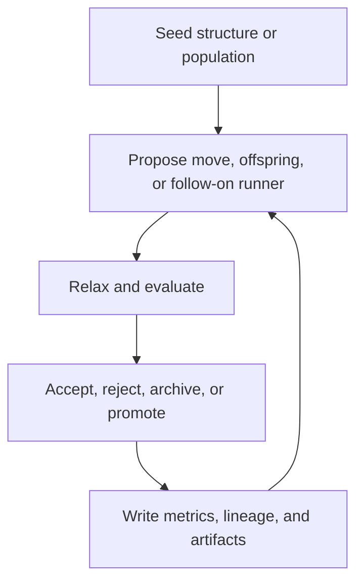

# 4.1 Global Optimisation Methods

  <code>patina</code> is fundamentally about searching rough energy landscapes while keeping enough
  reporting structure that a result can be explained, audited, and rerun.

## Method Map

- [4.1.1 Genetic Algorithm](genetic-algorithm.html):
  Population-driven search with selection pressure, variation, duplicate handling, and
  generation-level reporting.
- [4.1.2 Basin Hopping](basin-hopping.html):
  Perturb, relax, and accept or reject on the transformed landscape rather than on raw coordinates
  alone.
- [4.1.3 Monte Carlo Search](monte-carlo-search.html):
  Temperature-mediated acceptance, annealing schedules, and threshold-style sampling sit in the
  same family.

## Narrative Scope

For this book, global optimisation is not one algorithm. It is a family of search strategies that
trade off three things differently:

- exploration breadth
- dependence on local relaxation
- amount of state that must be preserved to make the run scientifically legible

That is why this chapter now treats five workflow families as first-class:

- genetic algorithms for population-driven exploration
- basin hopping for perturb-relax-accept loops
- simulated annealing for temperature-controlled local exploration
- energy-lid workflows for threshold-window sampling
- hybrid GA production for combining broad search with stricter downstream evaluation

## Common Objective

All of these methods are different ways of exploring candidates while trying to reduce an objective
such as the relaxed energy:

$$
x^\star = \arg \min_{x \in \Omega} E(x)
$$

The difficult part is that the search space \(\Omega\) is combinatorial and geometric at the same
time. The algorithm must decide:

- how to propose a new candidate
- when to pay the cost of evaluation or relaxation
- when two candidates are effectively the same for reporting purposes
- which artifacts to keep so the run can be reconstructed later

## Literature Anchors

The literature map behind this section already separates into three durable lanes:

- crystal and framework prediction:
  genetic-algorithm based inorganic crystal prediction was already established in
  @woodley1999ga, and the broader field position was surveyed in @woodley2008csp
- nanocluster structure search:
  the nanoscale GA work in @lazauskas2017ga makes duplicate control, topological
  analysis, and structure diversity central rather than optional
- surfaces and extended materials:
  global optimisation is also a surface-reconstruction tool, as shown in the polar perovskite case
  study of @deaconsmith2014surface

For `patina`, this split is useful because the same search abstractions need to serve clusters,
periodic materials, and eventually surface or interface workflows without collapsing them into one
oversimplified story.

## Shared Search Skeleton

{{#tabs global="optimisation-lens"}}
{{#tab name="Materials Lens"}}

The scientific question is how effectively the method samples low-energy motifs without confusing
duplicate rediscovery for genuine exploration.

{{#endtab}}
{{#tab name="Software Lens"}}

The software question is how to keep proposal logic, evaluator boundaries, restart state, and
artifact writing separated enough that a run can be ported and audited cleanly.

{{#endtab}}
{{#tab name="Bridge"}}

The bridge is provenance. A search method only becomes a scientific reporting method when its
candidate lineage, acceptance decisions, and result summaries are visible after the run.

{{#endtab}}
{{#endtabs}}

## Comparative Workflow Map

| Workflow family | Scientific role | KLMC3 owner | PATINA owner today | Current reading |
| --- | --- | --- | --- | --- |
| Genetic algorithm | Broad motif discovery under population pressure | `GeneticAlgorithm.f90`, `Population.f90`, `Master.f90` | `patina-search`, `patina-driver`, `patina-types` | Real workflow with tracked artifacts; full lifecycle parity still needs preserved fixtures. |
| Basin hopping | Perturb-relax-accept on a transformed landscape | `BasinHopping.f90`, `Moveclass.f90`, `Population.f90` | `patina-search::scott_kernels`, `patina-driver::application::basin_hopping` | Typed controller and restart seams exist; native remains owner for exact move-class parity. |
| Simulated annealing | Temperature-controlled acceptance and quench exploration | `Annealing.f90`, `MonteCarlo.f90`, `Population.f90`, `Master.f90` | `patina-search::scott_kernels::annealing`, follow-on driver workflow | Schedule kernels and live route exist; native restart and runner comparisons are still missing. |
| Energy lid | Threshold-window exploration around known seeds | `Thresholds.f90`, `MonteCarlo.f90`, `Master.f90` | `patina-search::scott_kernels::energy_lid`, follow-on driver workflow | Threshold schedule and live route exist; exact accepted-window semantics still need fixture evidence. |
| Hybrid GA production | Search followed by selective production-style evaluation | `ProductionRun.f90` plus GA helpers | `patina-search::scott_kernels::hybrid`, `patina-driver::application::hybrid_ga_production` | Strong Rust-owned orchestration surface; full in-loop Scott enforced-crossover parity is not complete. |

## Workflow Narratives

### Genetic Algorithm

The genetic-algorithm family is the broadest exploratory method in the current project story. It
is the right choice when the main scientific risk is missing whole motif families rather than
over-sampling one local basin.

{{#tabs global="go-ga-compare"}}
{{#tab name="KLMC3 Lens"}}

KLMC3 treated GA as a native production workflow, owned primarily by `GeneticAlgorithm.f90`,
`Population.f90`, and `Master.f90`. The important point is not only crossover or mutation. It is
that duplicate pressure, repopulation, archive movement, and evaluator staging were all part of
one tightly coupled run model.

{{#endtab}}
{{#tab name="PATINA Lens"}}

PATINA splits that story more explicitly across `patina-search`, `patina-driver`, and typed artifacts.
That gives clearer run manifests, controller traces, generation metrics, and restart surfaces. The
cost is that exact lifecycle parity with the native Scott implementation still has to be proven
with preserved fixtures rather than assumed from similar route names.

{{#endtab}}
{{#tab name="Bridge"}}

The bridge principle is that GA is scientifically credible only when diversity, duplicate control,
and archive evolution are visible after the run. That is where the public `patina` docs should stay
strict.

{{#endtab}}
{{#endtabs}}

### Basin Hopping

Basin hopping is narrower than GA but often cleaner to reason about scientifically. It concentrates
search effort by repeatedly perturbing one accepted state, relaxing, and then deciding whether the
relaxed result belongs in the running trajectory.

{{#tabs global="go-bh-compare"}}
{{#tab name="KLMC3 Lens"}}

In KLMC3, basin hopping lived inside the native move-class and population machinery. That means
step-size escalation, moveclass unlocking, and topology-aware behavior were not auxiliary
post-processing steps but part of the workflow semantics.

{{#endtab}}
{{#tab name="PATINA Lens"}}

In PATINA, the basin-hopping controller is now much more explicit: typed configuration, restart
seams, evaluation routing, and matched-depth hooks exist in Rust. The current limit is not
architectural clarity; it is that exact native move-class and fixture parity is still incomplete.

{{#endtab}}
{{#tab name="Bridge"}}

The bridge is continuity. A basin-hopping run only makes sense if the accepted local minimum,
proposal regime, and rejection history stay attached to the same walker narrative.

{{#endtab}}
{{#endtabs}}

### Simulated Annealing

Simulated annealing sits inside the Monte Carlo family, but in this project it deserves separate
attention because it is already exposed as a concrete follow-on workflow from tracked GA runs. The
scientific promise is not broad motif generation. It is controlled local exploration around already
good seeds under an explicit cooling schedule.

{{#tabs global="go-sa-compare"}}
{{#tab name="KLMC3 Lens"}}

KLMC3 owned annealing through `Annealing.f90`, `MonteCarlo.f90`, `Population.f90`, and
`Master.f90`. The important semantic objects were the temperature ladder, hold windows, runner
branching, and how quenches folded back into the best-set story.

{{#endtab}}
{{#tab name="PATINA Lens"}}

PATINA now has extracted annealing schedule kernels and a live `run-simulated-annealing` route fed
from tracked GA results. That is a stronger public story than before because the follow-on intent
is explicit. The remaining gap is preserved-evidence comparison for restart behavior, runner
branching, and best-set movement.

{{#endtab}}
{{#tab name="Bridge"}}

The bridge is schedule transparency. If the temperature history is not preserved, then the
scientific meaning of the accepted trajectory becomes hard to defend.

{{#endtab}}
{{#endtabs}}

### Energy Lid And Threshold Sampling

Energy-lid workflows are closely related to annealing but conceptually different. Instead of
controlling acceptance through temperature, they control sampling through an explicit energy window
or threshold ladder. That makes them useful when the question is "which structures are accessible
below this moving lid?" rather than "how does a cooling schedule balance uphill and downhill
acceptance?"

{{#tabs global="go-lid-compare"}}
{{#tab name="KLMC3 Lens"}}

KLMC3 owned this family through `Thresholds.f90`, `MonteCarlo.f90`, and `Master.f90`. The key
semantic issue was not just the threshold value itself, but the accepted-window reference, runner
lineage, and how basin branching was recorded as the lid changed.

{{#endtab}}
{{#tab name="PATINA Lens"}}

PATINA has extracted threshold kernels, a live `run-energy-lid` route, and corrected absolute
candidate-energy acceptance semantics. That already makes the Rust implementation easier to reason
about. What remains is preserved native evidence for first-accepted reference behavior, runner
counts, and archive/reset semantics.

{{#endtab}}
{{#tab name="Bridge"}}

The bridge is that energy-lid sampling should be documented as a controlled accessibility study,
not as a vague Monte Carlo variant. The threshold ladder is part of the scientific method.

{{#endtab}}
{{#endtabs}}

### Hybrid Genetic Algorithms

Hybrid GA in this project means more than "GA plus another operator." It usually means that
population-driven exploration is followed by a more selective downstream evaluation or promotion
phase. That is especially important in PATINA because the search stage and the production-style
evaluation stage do not necessarily have the same cost, fidelity, or artifact rules.

{{#tabs global="go-hybrid-compare"}}
{{#tab name="KLMC3 Lens"}}

KLMC3 folded hybrid behavior into `ProductionRun.f90` plus GA crossover helpers. The decisive idea
was enforced crossover and controlled promotion of GA-derived material into a stricter production
lane rather than treating search and production as unrelated campaigns.

{{#endtab}}
{{#tab name="PATINA Lens"}}

PATINA already has a real `run-hybrid-ga-production` route with explicit promotion metadata, nested
GA and production artifact trees, and optional emulator-related outputs. That is a good public
architecture story because the downstream promotion trace is explicit. The parity caveat is that
full in-loop Scott enforced-crossover behavior is not yet complete.

{{#endtab}}
{{#tab name="Bridge"}}

The bridge is promotion discipline. Hybrid workflows are scientifically valuable only if the book
can explain why one seed was promoted, under which evaluator policy, and with which provenance.

{{#endtab}}
{{#endtabs}}

## Stable `patina` Reading

The current Rust workspace is still moving, but several reporting ideas are durable enough to
document now:

- a candidate should cross a typed workflow boundary before external evaluation
- generation and controller metrics are first-class GA artifacts, not optional afterthoughts
- restart checkpoints matter because long-running search is part of the intended operating model
- topology or identity analysis should influence reporting and duplicate policy explicitly
- the search method pages should link back to [6.1 Hexagonal Ports And Adapters](../software-architecture/hexagonal-architecture.md) when the boundary design matters

The next three pages explain the main global-optimisation families with equations, executable Rust
snippets, literature anchors, and the current `patina` reporting surfaces. The next chapter,
[4.2 Emulators](emulators.html), covers the advisory surrogate-learning lane separately so it does
not get confused with deterministic parity-core search semantics.
