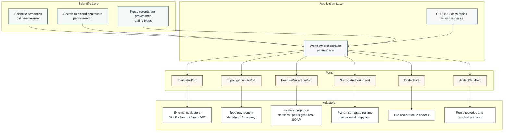

# 6.1 Hexagonal Ports And Adapters

Hexagonal architecture, also called ports and adapters, was introduced by Alistair Cockburn to keep
core logic independent from external technologies @cockburn2005.

In `patina`, that pattern is not only a software-quality preference. It is also a scientific safety
mechanism.

{{#tabs global="lens"}}
{{#tab name="Software Lens"}}

The software view is the classic one:

- the core owns semantics and use cases
- ports define what the outside world must provide
- adapters translate files, CLIs, Python processes, and external codes into those ports

That separation improves testability, reduces incidental coupling, and makes it practical to swap
or extend evaluators without rewriting the core controller logic.

{{#endtab}}
{{#tab name="Materials Lens"}}

The materials-science consequence is more specific:

- typed structure semantics should not be owned by file templates
- scientific transforms should not be hidden inside subprocess wrappers
- external-program quirks should not silently redefine the meaning of the search state

If those boundaries blur, the project stops being auditable. Readers can no longer tell whether a
behavior comes from the intended scientific model or from an accidental backend convention.

{{#endtab}}
{{#tab name="Bridge"}}

For this project, a useful working picture is:

The bridge principle is:

- keep the science inside the semantic core
- keep the orchestration inside the application layer
- let adapters do translation work, not policy work

That is why the software and science narratives belong together here instead of in isolated books.

{{#endtab}}
{{#endtabs}}

## Expanded Reading

The point of the hexagonal model in `patina` is not diagram aesthetics. It is to keep several
high-risk boundaries under control at once:

- exact scientific semantics versus transport records
- deterministic workflow logic versus external process behavior
- parity-core workflows versus advisory research lanes such as emulation
- user-facing launch surfaces versus internal persistence and artifact layout

That is why the diagram has more than one adapter type. Evaluators, codecs, topology identity,
feature projectors, and surrogate runtimes all deserve separate ports because they fail for
different reasons and carry different scientific risks.
