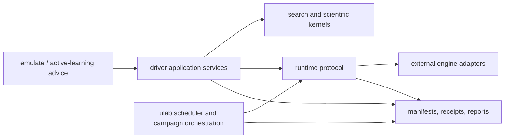

# 6.7 Runtime And Campaign Boundaries

  The public architecture story should make one thing clear: scientific workflow meaning,
  external-program execution, scheduler orchestration, and learned-model advice are different
  responsibilities.

## Reader Contract

This page gives a stable vocabulary for runtime and campaign boundaries. It is deliberately higher
level than the internal checkpoint notes under `docs/`.

## Boundary Map

## Stable Ownership Rules

| Responsibility | Owner in the public story | Must not silently absorb |
| --- | --- | --- |
| Search semantics | scientific kernels and driver application services | scheduler mechanics or backend file quirks |
| External engine execution | external adapters | search acceptance policy |
| Scheduler orchestration | `ulab` and runtime receipts | scientific truth or evaluator parsing |
| Surrogate advice | emulate / active-learning layer | deterministic parity claims |
| Evidence | manifests, checkpoints, reports, receipts | hidden machine-local defaults |

The ports-and-adapters framing in this book is aligned with the hexagonal-architecture rule that
domain logic should be insulated from external tools and delivery mechanisms @cockburn2005.

## Active Learning Boundary

Active-learning literature is useful here because it gives a vocabulary for uncertainty, acquisition,
promotion, and exact calls. Materials active-learning reviews emphasize adaptive sampling under
uncertainty @lookman2019active. FLARE and DP-GEN show different concrete versions of the same
architectural pressure: a model can decide when more first-principles data is needed, but the data
generation and exact-evaluation boundary remains explicit @vandermause2020flare @zhang2020dpgen.

For `patina`, that means:

- an emulator can advise, rank, gate, or request exact evaluation
- exact backend results remain evaluator evidence
- model identity, calibration evidence, and uncertainty should become provenance fields
- active learning belongs above runtime and evaluator adapters, not inside a parser or deck writer

## HPC Boundary

HPC execution should be presented as a control-plane problem, not a change in scientific meaning.

The runtime story should keep these layers separate:

- the scientific job request
- the external engine invocation
- the scheduler receipt
- the allocation-local progress report
- the final parsed evaluator result

That separation protects the project from two common errors:

- treating a scheduler state such as `running` as proof of scientific progress
- treating a copied output file as trustworthy without parser and provenance evidence

## Campaign Artifacts

Campaign-scale runs should preserve enough information to reconstruct what happened:

- input structure and candidate lineage
- evaluator backend and version
- external binary or Python runtime provenance
- scheduler receipt when relevant
- accepted, rejected, failed, and retried states
- model version and uncertainty when a surrogate influenced a decision

## Good Next Edits

The next useful expansion is a small end-to-end example:

1. GA proposes a candidate.
2. Duplicate policy checks identity.
3. The runtime dispatches an exact evaluation.
4. The external adapter materializes input and parses output.
5. `ulab` records scheduler or shard evidence when the job runs on HPC.
6. The report records whether any emulator advice influenced the decision.
